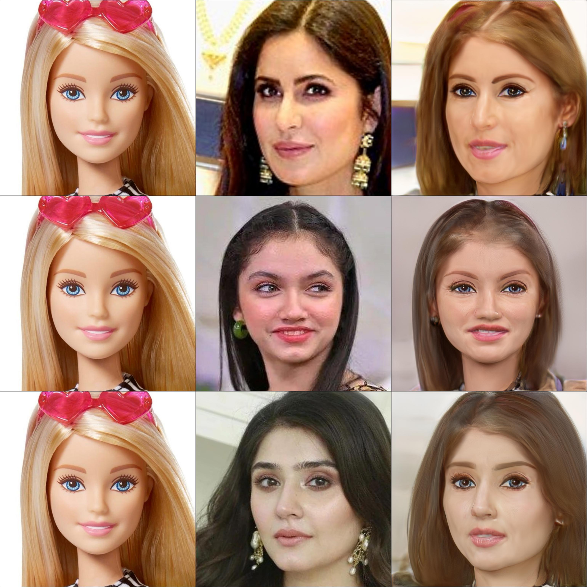

# JoJoGAN Face Stylizer Web App

A lightweight and powerful web app that transforms human faces into artistic styles using **JoJoGAN**, a few-shot face stylization model built on top of StyleGAN2. This app allows users to upload any face image and stylize it with a selected pretrained style like "jojo", "disney", or "sketch" using a simple Gradio interface.



---

## 💡 Concept

**JoJoGAN** (JoJo Generative Adversarial Network) is a technique for few-shot face stylization. It combines:

- **StyleGAN2**: A powerful GAN model trained on high-resolution faces.
- **e4e Inversion**: Converts a real image into a latent vector that StyleGAN can edit.
- **Few-shot fine-tuning**: Learns a style from just 1-5 style images and applies it to any face.

This project builds on JoJoGAN by providing a ready-to-use web app and training pipeline that makes it easy to:
- Apply existing styles (like JoJo, Disney, etc.)
- Train your own style from reference images
- Visualize results side by side

---

## 🧠 Features

- ✅ Upload any real face image
- 🎨 Choose from 5 pretrained styles
- ⚙️ On-demand model weight downloading (via Google Drive)
- 💻 Works on CPU and GPU
- 🌐 Web UI using Gradio (with public sharing link)
- 🔧 Fine-tune new styles with just a few reference images

---

## 🖼️ Pretrained Styles Included

- `jojo`
- `disney`
- `sketch_multi`
- `arcane_multi`
- `art`

---

## 🗂️ Project Structure

```
JoJoGAN-Face-Stylizer/
├── app.py                        # Web app with pretrained styles
├── fine_tune_pipeline.py        # Fine-tune on your own styles
├── requirements.txt             # All dependencies
├── README.md                    # This file
├── .gitignore                   # Files/folders to exclude from GitHub
├── models/                      # Pretrained base model + shape predictor
│   ├── stylegan2-ffhq-config-f.pt
│   ├── e4e_ffhq_encode.pt
│   └── dlibshape_predictor_68_face_landmarks.dat
├── pretrained_weights/          # Pretrained style checkpoints (auto-downloaded)
├── test_input/                  # Real input images to stylize
├── style_images/                # Custom reference style images (for fine-tuning)
├── style_images_aligned/        # Aligned version of style images
├── inversion_codes/             # Latent codes for inputs & styles
├── stylized_results/            # Output images after stylization
└── final_results_grid.jpg       # Grid of all stylized outputs
```

---

## 🚀 Getting Started

### 1. Clone the repo

```bash
git clone https://github.com/ghafoor545/JoJoGAN-Face--Stylizer.git
cd JoJoGAN-Face--Stylizer 
```

### 2. Install dependencies

```bash
pip install -r requirements.txt
```

> You must also install `gdown` to enable weight downloads:

```bash
pip install gdown
```

### 3. Run the web app

```bash
python app.py
```

It will launch a Gradio app and give you a local and public link.

### 4. (Optional) Fine-tune on your own style

1. Place real images in `test_input/`
2. Place style images in `style_images/`
3. Run:

```bash
python fine_tune_pipeline.py
```

It will generate:
- Output images for each face
- A final grid saved as `final_results_grid.jpg`

---

## 🧠 Model Credits

- **JoJoGAN** by Michael Chong: [https://github.com/mchong6/JoJoGAN](https://github.com/mchong6/JoJoGAN)
- Based on:
  - [StyleGAN2](https://github.com/NVlabs/stylegan2)
  - [e4e: Encoding for Editing](https://github.com/omertov/encoder4editing)

---

## 📄 License

This project is for educational purposes and uses publicly available pretrained weights. Please refer to the original JoJoGAN repo for license terms.

---

## 🤝 Contribution

Feel free to fork and add:
- More styles
- Webcam support
- Hugging Face deployment

PRs welcome!

---

## 👨‍💻 Maintainer

**Ghafoor Khan**  
**Gen AI Team Beta**


